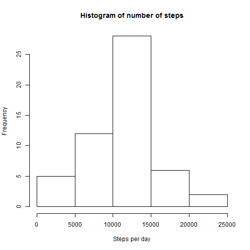
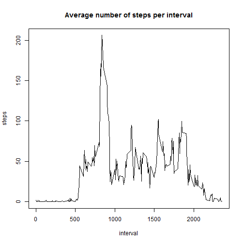
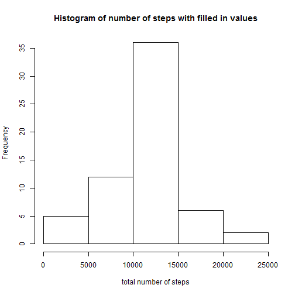
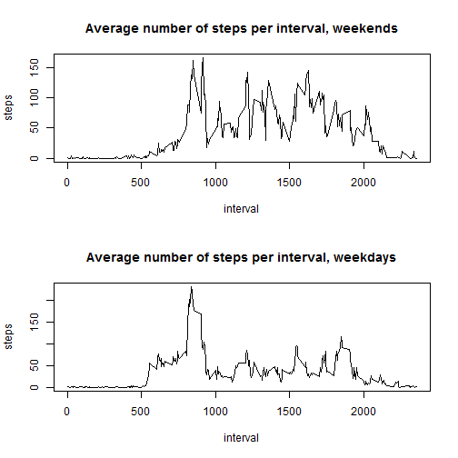

##Loading and preprocessing the data


```r
activity <- read.csv("repdata_data_activity/activity.csv")
summary(activity)
```

```
##      steps                date          interval     
##  Min.   :  0.00   2012-10-01:  288   Min.   :   0.0  
##  1st Qu.:  0.00   2012-10-02:  288   1st Qu.: 588.8  
##  Median :  0.00   2012-10-03:  288   Median :1177.5  
##  Mean   : 37.38   2012-10-04:  288   Mean   :1177.5  
##  3rd Qu.: 12.00   2012-10-05:  288   3rd Qu.:1766.2  
##  Max.   :806.00   2012-10-06:  288   Max.   :2355.0  
##  NA's   :2304     (Other)   :15840
```

##What is the mean total number of steps taken per day?

1.Total number of steps taken per day:


```r
totalSteps <- aggregate(steps ~ date, data = activity, sum)
hist(totalSteps$steps, xlab="Steps per day", main = "Histogram of number of steps")
```

 

3.Mean and median of steps per day:


```r
mean(totalSteps$steps)
```

```
## [1] 10766.19
```

```r
median(totalSteps$steps)
```

```
## [1] 10765
```

##What is the average daily activity pattern?

1.Total number of steps taken per interval:


```r
intervalSteps <- aggregate(steps ~ interval, data = activity, mean)
plot(intervalSteps, type='l', main="Average number of steps per interval")
```

 

2.Interval with maximum number of steps on average:


```r
intervalSteps[intervalSteps$steps == max(intervalSteps$steps),]$interval
```

```
## [1] 835
```

##Imputing missing values

1. Number of missing values:


```r
sum(is.na(activity))
```

```
## [1] 2304
```

2. Strategy for filling in missing values:

First we introduce this function where we check if a value is na and if so, we replace it with another value


```r
missing <- function(x, y){
  if(is.na(x)){
    x=y
  }else{
    x
  }
}
```

Now we merge the data frame activity with intervalSteps so that we get a new data frame with four columns where the fourth represent the average number of steps for that interval. We sort the data frame and use mapply to check if the values in steps are NA and if so we replace it with the mean of the interval:


```r
activityWithMean <- merge(activity, intervalSteps, by.x="interval", by.y="interval")

activityWithMean <- activityWithMean[order(activityWithMean$date),]

activityWithMean$steps.x <- mapply(FUN = missing, activityWithMean$steps.x, activityWithMean$steps.y)
```

3. Now we replace the column of steps in activity with the one in activity and get a new dataset


```r
activityFilled <- activity
activityFilled[,1] <- activityWithMean$steps.x
summary(activityFilled)
```

```
##      steps                date          interval     
##  Min.   :  0.00   2012-10-01:  288   Min.   :   0.0  
##  1st Qu.:  0.00   2012-10-02:  288   1st Qu.: 588.8  
##  Median :  0.00   2012-10-03:  288   Median :1177.5  
##  Mean   : 37.38   2012-10-04:  288   Mean   :1177.5  
##  3rd Qu.: 27.00   2012-10-05:  288   3rd Qu.:1766.2  
##  Max.   :806.00   2012-10-06:  288   Max.   :2355.0  
##                   (Other)   :15840
```

4. We create a histogram of total number of steps and calculate mean and median:


```r
totalStepsFilled <- aggregate(steps ~ date, data = activityFilled, sum)
hist(totalStepsFilled$steps, xlab="total number of steps", main="Histogram of number of steps with filled in values")
```

 

Mean and median: 


```r
mean(totalStepsFilled$steps)
```

```
## [1] 10766.19
```

```r
median(totalStepsFilled$steps)
```

```
## [1] 10766.19
```

The difference is not so big compared to the mean and median for the data including NA's. I have choosen to replace the missing value with the mean of that interval which may not be a good replacement. Maybe there should be an impact on the value from the interval before and after as well since that may describe number of steps due to a specific activity better. Since I add the mean it is not so peculiar that the mean do not change that much from the initial data.

##Are there any difference in activity patterns between weekdays and weekends?

We start with converting the dates to the type Date so we can use the function weekdays. We add a column with the name of the day and then another column with weekday or weekend depending on which day it is.

```r
activityFilled$date <- as.Date(activityFilled$date)

activityFilled$day <- weekdays(activityFilled$date)

activityFilled$dayType <- ifelse(activityFilled$day=="lördag" | activityFilled$day=="söndag", "weekend", "weekday")
```

Now we subset the dataset into two datasets, one for weekends and one for weekdays. The mean for each interval is calculated for both datasets.

```r
weekdayData <- activityFilled[activityFilled$dayType == "weekday",]
weekendData <- activityFilled[activityFilled$dayType == "weekend",]
intervalWeekend <- aggregate(steps ~ interval, data = weekendData, mean)
intervalWeekday <- aggregate(steps ~ interval, data = weekdayData, mean)
```

We create a plot consisting of two subplots.

```r
par(mfrow=c(2,1))
plot(intervalWeekend, type='l', main="Average number of steps per interval, weekends")
plot(intervalWeekday, type='l', main="Average number of steps per interval, weekdays")
```

 
